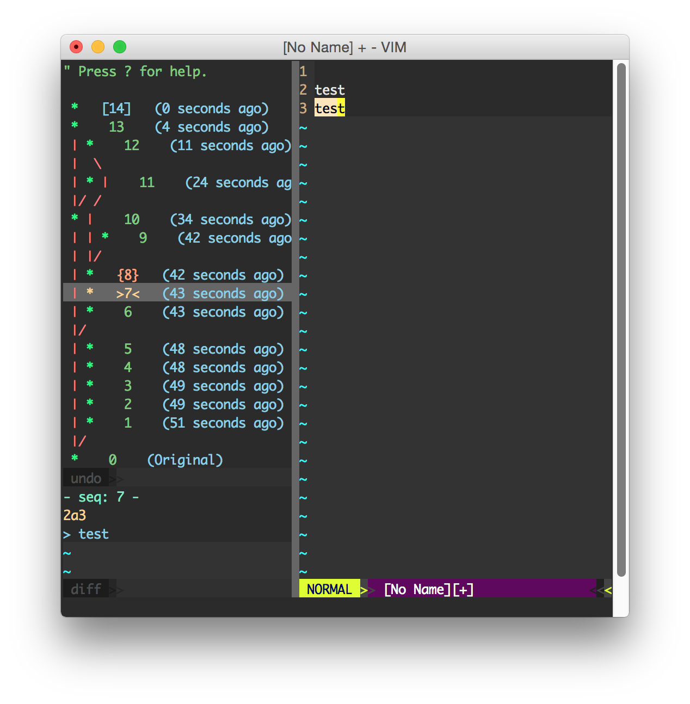

### [Project on Vim.org](http://www.vim.org/scripts/script.php?script_id=4177)

[](https://gitter.im/mbbill/undotree?utm_source=badge&utm_medium=badge&utm_campaign=pr-badge&utm_content=badge)

### Screenshot



### Table of Contents

<!-- TOC -->

- [Description](#description)
- [Download and Install](#download-and-install)
- [Usage](#usage)
    - [Configuration](#configuration)
    - [Debug](#debug)
- [License](#license)
- [Author](#author)

<!-- /TOC -->

### Description

Undotree visualizes the undo history and makes it easy to browse and switch between different undo branches. You may be wondering, _what are undo "branches" anyway?_ They're a feature of Vim that allow you to go back to a prior state even after it has been overwritten by later edits. For example: In most editors, if you make some change A, followed by change B, then go back to A and make another change C, normally you wouldn't be able to go back to change B because the undo history is linear. That's not the case with Vim, however. Vim internally stores the entire edit history for each file as a single, monolithic tree structure; this plug-in exposes that tree to you so that you can not only switch back and forth between older and more recent edits linearly but can also switch between diverging branches.

> Note: use `:help 'undolevels'` in Vim for information on configuring the size of the undo history


### How it works

Some users may have questions about whether file contents change when switching between undo history states. With undotree, you don't need to worry about data loss or disk writes. The plugin will **never** save your data or write to disk. Instead, it modifies the current buffer temporarily, just like auto-completion plugins do. This means that any changes made by undotree are reversible with a single click, allowing you to easily revert to any prior state.

Vim's undo/redo feature is a great way to protect your work from accidental changes or data loss. Unlike other editors, where undoing and then accidentally typing something can cause you to lose your edits, Vim allows you to revert to previous states without losing any data, as long as you keep the Vim session alive. If you want to keep your undo history permanently, Vim offers a persistent undo feature. This feature saves your undo history to a file on disk, allowing you to preserve your undo history across editing sessions. To enable persistent undo, refer to the instructions below. This can be a useful option for those who want to maintain a long-term undo history for a file or project.

### Persisting the undo history

Undo/redo functionality is a useful feature for most editors, including Vim. However, by default, Vim's undo history is only available during the current editing session, as it is stored in memory and lost once the process exits. While tools such as undotree can aid in accessing historical states, it does not offer a permanent solution. For some users, it may be safer or more convenient to persist the undo history across editing sessions, and that's where Vim's persistent undo feature comes in.

Persistent undo saves the undo history in a file on disk, rather than in RAM. Whenever a change is made, Vim saves the edited file with its current state, while also saving the entire undo history to a separate file on disk that includes all states. This means that even after exiting Vim, the undo history is still available when you reopen the file, allowing you to continue to undo/redo changes. The undo history file is incremental and saves every change permanently, similar to Git.

If you're worried about the potential storage space used by persistent undo files, undotree provides an option to clean them up. Additionally, undotree is written in pure Vim script, making it lightweight, simple, and fast, and only runs when needed. To enable persistent undo, simply type `:h persistent-undo` in Vim, or follow the instructions provided in the *Usage* section below.

### Download and Install

Using Vim's built-in package manager:

```sh
mkdir -p ~/.vim/pack/mbbill/start
cd ~/.vim/pack/mbbill/start
git clone https://github.com/mbbill/undotree.git
vim -u NONE -c "helptags undotree/doc" -c q
```

Use whatever plug-in manager to pull the master branch. I've included 2 examples of the most used:

- *Vundle:* `Plugin 'mbbill/undotree'`
- *Vim-Plug:* `Plug 'mbbill/undotree'`
- *Packer:* `use 'mbbill/undotree'`

And install them with the following:

- *Vundle:* `:PluginInstall`
- *Vim-Plug:* `:PlugInstall`
- *Packer:* `:PackerSync`

### Usage

  1. Use `:UndotreeToggle` to toggle the undo-tree panel. 

  You may want to map this command to whatever hotkey by adding the following line to your vimrc, take `F5` for example.

```vim
nnoremap <F5> :UndotreeToggle<CR>
```

  Or the equivalent mapping if using Neovim and Lua script.

```lua
vim.keymap.set('n', '<leader><F5>', vim.cmd.UndotreeToggle)
```

  2. Markers
     * Every change has a sequence number and it is displayed before timestamps.
     * The current state is marked as `> number <`.
     * The next state which will be restored by `:redo` or `<ctrl-r>` is marked as `{ number }`.
     * The `[ number ]` marks the most recent change.
     * The undo history is sorted by timestamps.
     * Saved changes are marked as `s` and the big `S` indicates the most recent saved change.
  3. Press `?` in undotree window for quick help.
  4. Persistent undo
     * Usually, I would like to store the undo files in a separate place like below.

```vim
if has("persistent_undo")
   let target_path = expand('~/.undodir')

    " create the directory and any parent directories
    " if the location does not exist.
    if !isdirectory(target_path)
        call mkdir(target_path, "p", 0700)
    endif

    let &undodir=target_path
    set undofile
endif
```

#### Configuration

[Here](https://github.com/mbbill/undotree/blob/master/plugin/undotree.vim#L15) is a list of options.

#### Debug

  1. Create a file under $HOME with the name `undotree_debug.log`
     * `$touch ~/undotree_debug.log`
  2. Run vim, and the log will automatically be appended to the file, and you may watch it using `tail`:
     * `$tail -F ~/undotree_debug.log`
  3. If you want to disable debug, just delete that file.

### License

**BSD**

### Author

Ming Bai  &lt;mbbill AT gmail DOT COM&gt;
